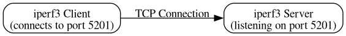
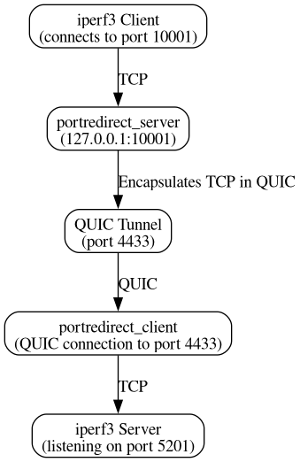

# PortRedirect

*Glue your frontend to the backend!*


## Intro

PortRedirect is basically a user space TCP forwarding solution. It is split into **server** and **client** sides.

**Server:** Redirects incoming TCP connections (e.g., port 443) to a remote *client* through a persistent QUIC connection. It acts as a QUIC server (e.g., port 1234 on a private interface) with a custom PortRedirect-RS application protocol

*In short:* Accepts incoming TCP connections and forwards them over a QUIC connection.

**Client:** Redirects incoming server-initiated QUIC streams (multiple streams inside one connection) to a *destination* TCP host and port (e.g., `localhost:4433`, where an HTTPS server might be running). It acts as a QUIC client by initiating the connection to the QUIC server

*In short:* Connects to the QUIC server and relays the tunneled streams to a designated destination.

### **Bling:**

[](https://codecov.io/gh/unspezifisch/portredirect-rs)

### **Concept:**

Let us sneakily introduce show you how this tunneling tool works, while describing essentially one of our CI tests.

Imagine running a web server such as nginx for HTTPS traffic—but instead, we use an iperf3 server to benchmark connection performance. In real-world scenarios, many clients can connect to a server in parallel, and all traffic must be reliably forwarded. In our CI tests, we compare two configurations: a baseline direct connection and a tunneled connection using PortRedirect-RS.

Below, **Figure 1** illustrates the baseline scenario where the iperf3 client connects directly to the iperf3 server over a standard TCP connection. This setup serves as our control measurement.

#### Figure 1: Baseline (Direct) Connection


*This diagram shows a direct TCP connection between the iperf3 client and server.*

In contrast, **Figure 2** demonstrates how PortRedirect-RS facilitates a tunneled connection. Here, the iperf3 client connects to an intermediate port monitored by the portredirect_server. The server encapsulates the TCP traffic in a persistent QUIC tunnel, which is then received by the portredirect_client and forwarded to the iperf3 server. This configuration simulates a scenario where services are hidden behind a secure tunnel, yet performance remains robust.

#### Figure 2: Tunneled Connection via PortRedirect


*This diagram illustrates how traffic is encapsulated in a QUIC tunnel by the portredirect_server and forwarded by the portredirect_client to the iperf3 server.*

## Installation

The easiest way to install PortRedirect-RS is via Cargo. Once installed, both binaries will be available on your system.

```sh
cargo install portredirect
```

## Usage

After installation, you can run the server and client directly from your command line. There’s no need to manually set extra environment variables unless you require additional logging or troubleshooting.

### Running the Frontend Server

Imagine you’re running a low-budget server (like a VPS with a public IP) that should be reachable on TCP port 443 (HTTPS). That traffic should be forwarded through a VPN (like Wireguard), where your server's VPN IP might be `10.0.0.1`. You’d then run the PortRedirect-RS server on that IP at port 12345.

**Command:**

```sh
portredirect_server \
    --local-host 0.0.0.0 --local-port 443 \
    --quic-server-host 10.0.0.1 --quic-server-port 12345 \
    --quic-psk your_psk_here
```

**Parameters Explained:**

- **`--local-host` & `--local-port`:** Where the server listens for incoming TCP connections.
- **`--quic-server-host` & `--quic-server-port`:** The network details for the QUIC connection.
- **`--quic-psk`:** A pre-shared key for authenticating the QUIC tunnel.

### Running the Backend Client

The client connects to the QUIC server and forwards the received streams to your target service.

For example, if you run an `nginx` HTTPS server on `127.0.0.1:4433` (serving, say, cat pictures) on your homeserver (with a big hard drive), which is connected via VPN to your frontend server, you can forward traffic like so:

```sh
portredirect_client \
    --destination-host 127.0.0.1 --destination-port 4433 \
    --quic-remote-host 10.0.0.1 --quic-remote-port 12345 \
    --quic-remote-hostname-match localhost \
    --quic-psk your_psk_here
```

**Parameters Explained:**

- **`--destination-host` & `--destination-port`:** The target host and port for relaying traffic.
- **`--quic-remote-host` & `--quic-remote-port`:** The QUIC server’s address and port.
- **`--quic-remote-hostname-match`:** Ensures the TLS certificate of the QUIC server matches the expected hostname. This must be the same as the `quic-server-host` parameter on the `portredirect_server` side.
- **`--quic-psk`:** Must match the server’s pre-shared key.

> **Important:** The client needs to verify the identity of the QUIC server using its certificate. On startup, both the server and client generate their own certificates if they do not already exist. These certificates are stored as `.der` files in the `~/.config/portredirect` directory.
>
> **Action Required:** Start the server first to generate its certificate, then copy the contents of the server’s `~/.config/portredirect` directory to the corresponding location on the client machine. A Trust-On-First-Use (TOFU) mechanism may be implemented in the future to streamline this process.

### Security Notice: PSK Best Practices

For secure operation of the QUIC server on untrusted interfaces, **always use a long and random pre-shared key (PSK)**.

**Recommendation:**  

- Use tools like [`pwgen`](https://linux.die.net/man/1/pwgen) or [`openssl rand`](https://www.openssl.org/docs/man1.1.1/man1/openssl-rand.html) to generate a robust PSK. For example:

  ```sh
  pwgen -s 32 1
  ```

  or

  ```sh
  openssl rand -hex 32
  ```

Ensure that the PSK you use for both the server and client matches exactly.

## Authentication & Certificate Verification

PortRedirect-RS employs an authentication mechanism to ensure secure communication over the QUIC tunnel. Although the QUIC port is typically publicly reachable via the Internet, the recommended deployment (as shown in the examples) is behind a VPN for enhanced security.

The main ideas are:

- **Server Trust:**  
  The client trusts the server because the server presents a public certificate that matches the expected configuration. This certificate is generated on the first run (if not already present) and stored in `~/.config/portredirect` as a `.der` file.

- **Client Authentication:**  
  The server, on the other hand, does not inherently trust the client. Anyone can connect and claim to speak the PortRedirect-RS protocol. Therefore, the client must prove its trustworthiness by responding to a server-issued challenge.

- **Challenge-Response Mechanism:**  
  The client must respond to a challenge that only it can correctly answer using the pre-shared key (PSK). The use of a PSK is favored for its simplicity and to avoid the need for exchanging certificates back *and forth*, which could become increasingly cumbersome with multiple clients.

## Running Tests

For an overview of the tests you might start looking at the GitHub Actions page, and the `.github/workflows` subdirectory.

### Cargo Tests

To verify that everything is working correctly, you can run the built-in test suite using Cargo:

```sh
cargo test
```

This command will execute all the tests associated with the project. If you wish to run a specific test, you can pass a pattern:

```sh
cargo test <test_pattern>
```

### BATS Tests

In addition to Cargo tests, there is an extensive suite of Bash Automated Testing System (BATS) tests located in the `./tests/` subdirectory. To run these tests, you need to have BATS installed.

1. **Install BATS:**
   - Follow the installation instructions from the [BATS-Core GitHub repository](https://github.com/bats-core/bats-core).

2. **Run the BATS Tests:**

   From the root of the repository, run:

   ```sh
   bats tests/
   ```

This command will execute all the BATS tests in the `tests/` directory.

## Command-Line Help

For a full list of options and defaults, simply run the help command for each binary:

- **Server Help:**

  ```sh
  portredirect_server --help
  ```

- **Client Help:**

  ```sh
  portredirect_client --help
  ```

## Overview & Limitations

PortRedirect-RS is best suited for scenarios where you need a straightforward TCP-to-QUIC tunnel without complex setup. Please note the following:

- **Protocol Support:** Currently supports IPv4 and TCP.
- **Connection Model:** Designed for one-to-one QUIC connections between server and client, with the possibility of extending this in the future.
- **Scalability:** Not yet optimized for extremely high concurrency.
- **Security:** We try our best but no guarantees, see [SECURITY](SECURITY.md).

## License

This project is licensed under the [GPL-3.0-only](LICENSE) license.
