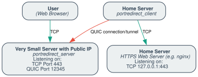

# PortRedirect

*Glue your frontend to the backend!*


## Introduction

PortRedirect is a lightweight user-space TCP forwarder that bridges your frontend and backend via a secure QUIC tunnel. It has two components:

- **Server:** Listens for incoming TCP connections (e.g., on port 443) and tunnels them over a persistent QUIC connection.
- **Client:** Connects to the QUIC server, receives tunneled streams, and forwards them to the target TCP service (e.g., `localhost:4433`).

Both use a pre-shared key (PSK) for authentication and auto-generate certificates on first run (stored in `~/.config/portredirect`).

### **Bling:**

[](https://codecov.io/gh/unspezifisch/portredirect)

### Concept

In this example, we compare two methods for a web browser to reach a secure HTTPS server:

- **Baseline (Direct) Connection:**  
  The user's web browser establishes a direct TCP connection to a public web server hosting HTTPS (Figure 1).

- **Tunneled Connection via PortRedirect:**
  In this scenario, a home server running PortRedirect's client establishes a secure QUIC tunnel with the small cheap public server, which then forwards incoming connections to us. The connections get patched through to a local HTTPS server (see Figure 2).
  The public side running PortRedirect's server can then accept TCP connections from browsers. By forwarding them through the established QUIC tunnel, they can communicate with the HTTPS server, almost as if we had rented a big publicly reachable server.

> **Note:** The arrows in the following diagrams indicate the initiator of the connection (not necessarily the direction of data flow, which can always be bidirectional).

#### Figure 1: Direct TCP Connection


*In this scenario, the user's web browser connects directly to the public HTTPS server using a standard TCP connection.*

#### Figure 2: Tunneled Connection via PortRedirect



*In the tunneled scenario, the user's web browser still initiates a TCP connection to the public endpoint. However, the connection is then forwarded through a secure QUIC tunnel, established between the home server (portredirect_client) and the frontend server (portredirect_server), to reach the internal HTTPS server.*

## Installation

Install via Cargo to get both binaries:

```sh
cargo install portredirect
```

## Usage

### Running the Frontend Server

For example, if your public server (accessible on TCP port 443) should forward traffic over a VPN (with an internal IP of `10.0.0.1`) on port 12345, run:

```sh
portredirect_server \
    --local-host 0.0.0.0 --local-port 443 \
    --quic-server-host 10.0.0.1 --quic-server-port 12345 \
    --quic-psk your_psk_here
```

**Parameters:**

- **`--local-host` & `--local-port`:** Where to listen for incoming TCP connections.
- **`--quic-server-host` & `--quic-server-port`:** QUIC tunnel details.
- **`--quic-psk`:** Pre-shared key for secure tunneling.

### Running the Backend Client

To forward traffic to a local service (e.g., an `nginx` server on `127.0.0.1:4433`), run:

```sh
portredirect_client \
    --destination-host 127.0.0.1 --destination-port 4433 \
    --quic-remote-host 10.0.0.1 --quic-remote-port 12345 \
    --quic-remote-hostname-match localhost \
    --quic-psk your_psk_here
```

**Parameters:**

- **`--destination-host` & `--destination-port`:** The target TCP service.
- **`--quic-remote-host` & `--quic-remote-port`:** The QUIC server’s address.
- **`--quic-remote-hostname-match`:** Ensures the server's TLS certificate is valid.
- **`--quic-psk`:** Must match the server’s PSK.

> **Important:** Start the server first to generate its certificate, then copy the contents of the server’s `~/.config/portredirect` directory to the client machine.

### PSK Best Practices

Always use a long, random pre-shared key when operating over untrusted networks. For example:

```sh
pwgen -s 32 1
```

or

```sh
openssl rand -hex 32
```

## Authentication & Certificate Verification

PortRedirect secures QUIC tunnels using auto-generated certificates and a PSK-based challenge-response system. The client verifies the server’s certificate, while the server challenges the client to prove its identity with the shared PSK.

## Running Tests

Use the Makefile to run all tests:

```sh
make test
```

### BATS Tests

Install [BATS-Core](https://github.com/bats-core/bats-core) and run:

```sh
bats tests/<test_file.bats>
```

## Command-Line Help

For a complete list of options:

- **Server Help:**  

  ```sh
  portredirect_server --help
  ```

- **Client Help:**  

  ```sh
  portredirect_client --help
  ```

- **Developer Help:**  

  ```sh
  # This means please look at the documentation inside the supplied `Makefile`
  less Makefile
  ```

## Overview & Limitations

PortRedirect is ideal for simple TCP-to-QUIC tunneling setups:

- **Protocol Support:** Currently supports IPv4 and TCP.
- **Connection Model:** Designed for one-to-one QUIC connections between server and client, with the possibility of extending this in the future.
- **Scalability:** Not yet optimized for extremely high concurrency.
- **Security:** We try our best but no guarantees, see [SECURITY](SECURITY.md).

## License

This project is licensed under the [GPL-3.0-only](LICENSE) license.
